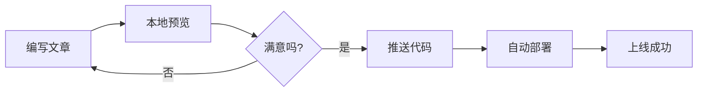
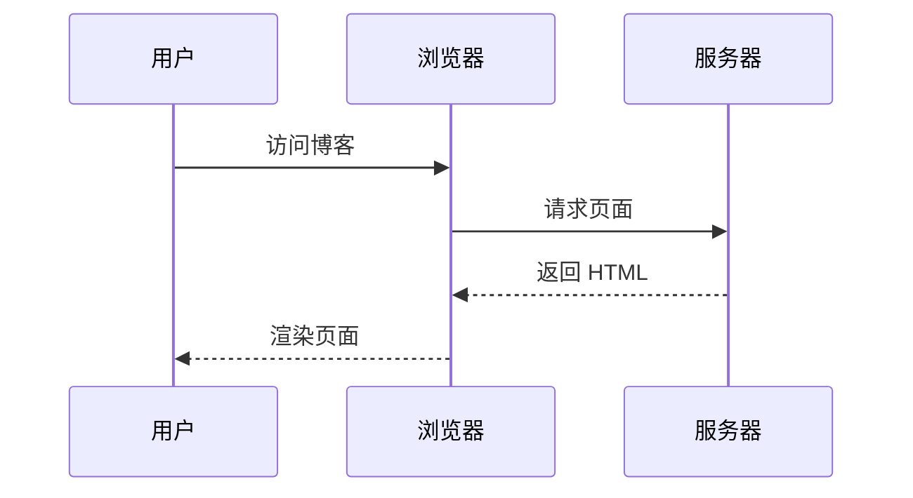
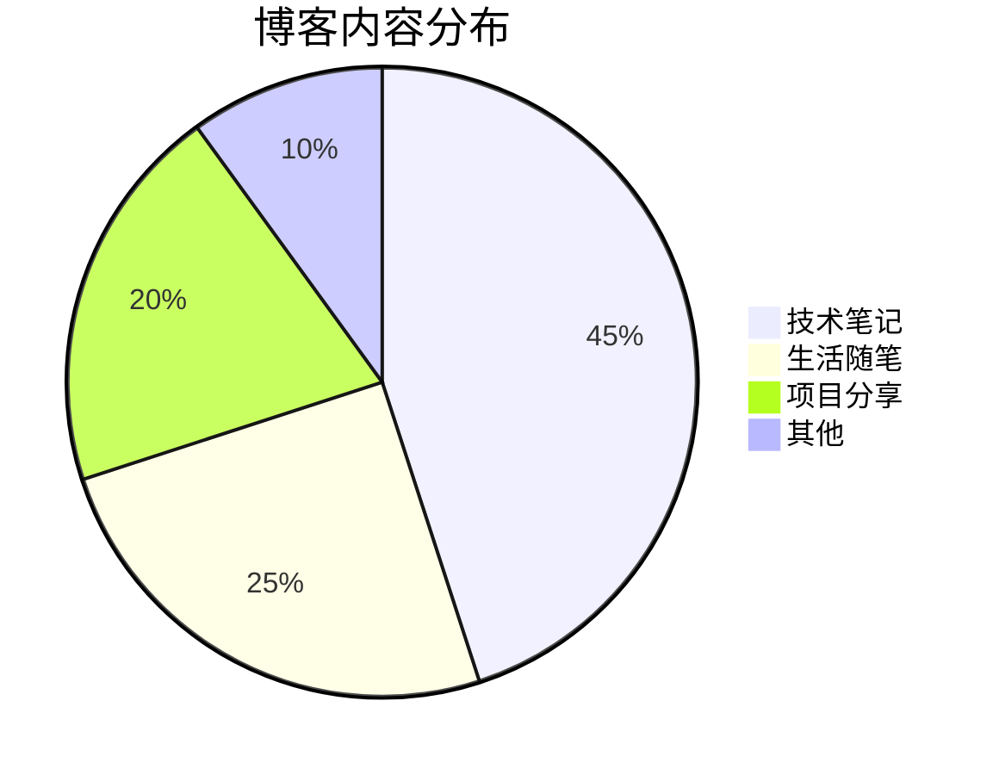

本文展示 astro-koharu 支持的所有 Markdown 增强功能。

## 链接嵌入

astro-koharu 支持自动嵌入独行链接，包括 Tweet 和通用链接预览。

### Tweet 嵌入测试

下面是一条独行的 Twitter 链接，应该自动转换为 Tweet 组件：

<https://twitter.com/vercel_dev/status/1997059920936775706>

这是普通段落中的链接 [Vercel Tweet](https://twitter.com/vercel_dev/status/1997059920936775706)，不应该被嵌入。

使用新域名 x.com 的 Tweet：

<https://x.com/vercel_dev/status/1997059920936775706>

### 通用链接预览测试

这是段落中的链接 [react-tweet](https://github.com/vercel/react-tweet)，不应该被嵌入。

下面是一个独行的普通链接，应该显示 OG 预览卡片：

<https://github.com/vercel/react-tweet>

<https://github.com/dimsemenov/photoswipe>

<https://github.com/zhw2590582/ArtPlayer>

<https://github.com/hymbz/ComicReadScript>

这是没有 OG 图的链接

<https://react-tweet.vercel.app/>

这是获取不到 OG 信息的链接

<https://zhuanlan.zhihu.com/p/1900483903984243480>

### Codepen 链接嵌入

<https://codepen.io/botteu/pen/YPKBrJX/>

### 链接嵌入规则

* 独行的 Twitter/X 链接自动转换为 Tweet 组件

* 独行的其他链接显示 OG 预览卡片

* 段落内的链接保持原样

* 支持深色/浅色主题切换

## 图片嵌入

图片会自动应用 LQIP（低质量图片占位符）效果：


## 视频嵌入

使用 `::video{}` 指令可以嵌入视频播放器：

::video{src="/media/test.webm"}

### 视频指令语法

```markdown
::video{src="/media/video.webm"}

::video{src="/media/video.mp4" poster="/img/poster.jpg"}

::video{src="/media/video.webm" autoplay loop muted}
```

**参数说明：**

* `src`：视频源地址（必填）

* `poster`：封面图片地址（可选）

* `autoplay`：自动播放（可选，布尔值）

* `loop`：循环播放（可选，布尔值）

* `muted`：静音（可选，布尔值）

* `controls`：显示控件（可选，默认 true）

* `playsinline`：移动端内联播放（可选，默认 true）

## 漫画阅读器

使用 `::comic{}` 指令可以嵌入漫画阅读器卡片。点击卡片即可全屏阅读漫画。\
::comic{id="manga1" name="催眠されちゃった私" src="/img/comic/manga1/manifest.json" author="みけねこ (simao)"}
::comic{id="manga2" name="教え子と理性崩壊セックス" src="/img/comic/manga2/manifest.json" author="みけねこ (simao)"}
::comic{id="manga3" name="少年よ、私を抱け。" src="/img/comic/manga3/manifest.json" author="鳥居ヨシツナ"}

### 漫画指令语法

```markdown
::comic{id="漫画ID" name="催眠されちゃった私" src="/path/to/manifest.json" author="みけねこ (simao) " cover="/path/to/cover.jpg"}
```

**参数说明：**

* `id`：漫画唯一标识符（必填）

* `name`：漫画显示名称（必填）

* `src`：manifest.json 文件路径（必填）

```bash
pnpm generate:comics
```

* `author`：作者名称（可选）

* `cover`：封面图片路径（可选）

## 代码高亮

支持多种编程语言的语法高亮，并自动跟随主题切换。

### JavaScript

```javascript
function greet(name) {
  console.log(`Hello, ${name}!`);
  return {
    message: "Welcome to astro-koharu",
    timestamp: Date.now(),
  };
}

greet("World");
```

### TypeScript

```typescript
interface BlogPost {
  title: string;
  date: Date;
  tags: string[];
  content: string;
}

const post: BlogPost = {
  title: "My First Post",
  date: new Date(),
  tags: ["astro", "blog"],
  content: "Hello World!",
};
```

### Python

```python
def fibonacci(n: int) -> list[int]:
    """Generate Fibonacci sequence"""
    if n <= 0:
        return []
    elif n == 1:
        return [0]

    fib = [0, 1]
    for i in range(2, n):
        fib.append(fib[i-1] + fib[i-2])
    return fib

print(fibonacci(10))
```

### Bash

```bash
#!/bin/bash
# Start development server
pnpm install
pnpm dev

echo "Server is running at http://localhost:4321"
```

## GFM 表格

| 功能   | 支持状态 | 说明       |
| ---- | ---- | -------- |
| 表格   | ✅    | 支持对齐     |
| 任务列表 | ✅    | 复选框      |
| 删除线  | ✅    | ~~删除文本~~ |
| 自动链接 | ✅    | 自动识别 URL |

## 任务列表

* [x] 安装 astro-koharu
* [x] 配置站点信息
* [ ] 写第一篇文章
* [ ] 部署到 Vercel

## Mermaid 图表

### 流程图



### 时序图



### 饼图



## 文本样式

* **粗体文本**

* *斜体文本*

* ~~删除线~~

* `行内代码`

* [链接文本](https://github.com/cosZone/astro-koharu)

## 引用

> 这是一段引用文本。\
> astro-koharu 让博客搭建变得简单而优雅。

## 标题层级

本文展示了 h2-h6 各级标题，它们都会自动生成锚点链接，方便分享和引用。

### 三级标题

#### 四级标题

##### 五级标题

###### 六级标题

## 分割线

***

## 列表

### 无序列表

* 项目一

  * 子项目 A

  * 子项目 B

* 项目二

* 项目三

### 有序列表

1. 第一步

2. 第二步

   1. 子步骤 A

   2. 子步骤 B

      1. 子步骤 C

3. 第三步

## 总结

以上展示了 astro-koharu 支持的主要 Markdown 功能。更多功能请参考 [使用指南](/post/astro-koharu-guide)。
